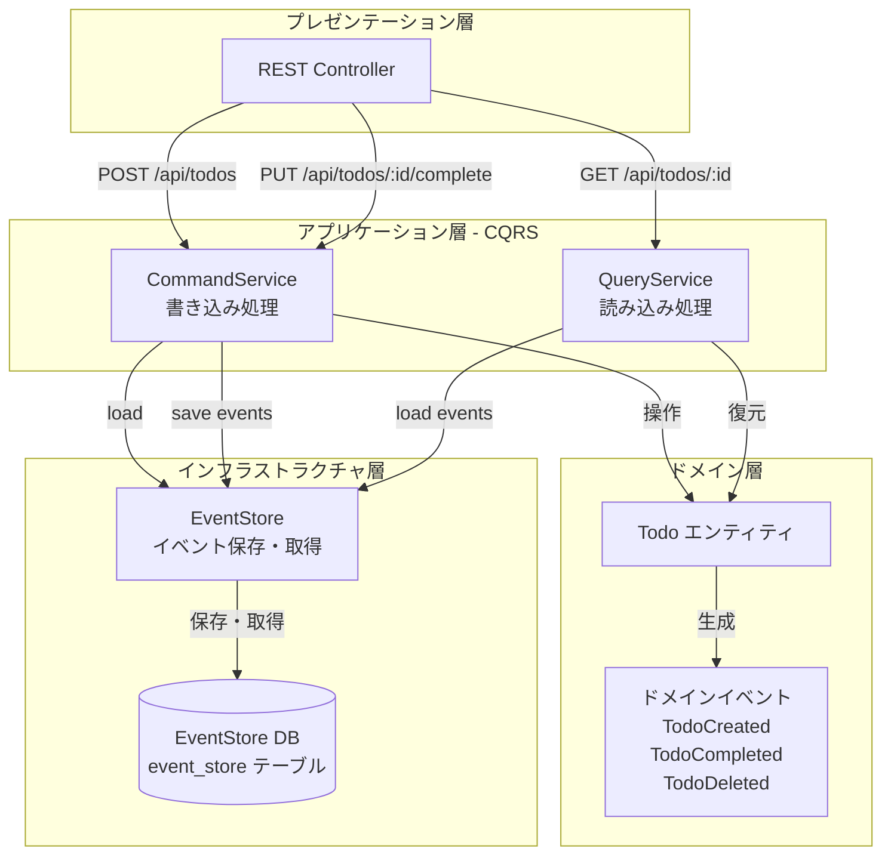
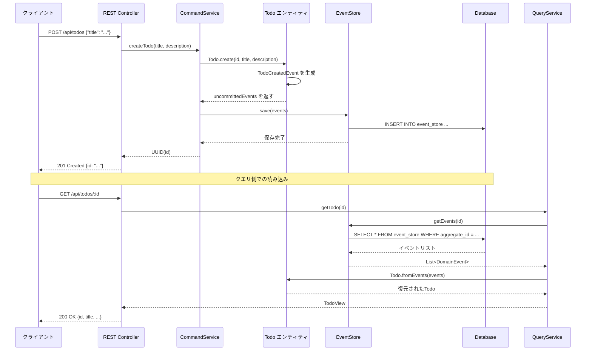

# CQRS + Event

Sourcing TODO アプリ実装計画

## アーキテクチャ概要

このアプリケーションは、CQRS（Command Query Responsibility Segregation）とEvent Sourcing（ES）を学習するためのシンプルなTODO管理アプリです。

### 主要な概念

#### Event Sourcing（イベントソーシング）

- 通常：現在の状態を直接保存（UPDATE文で変更）
- ES：すべての変更をイベントとして記録。現在の状態はイベントを再生して再構築
- メリット：完全な変更履歴、時系列での状態遷移が可能、監査ログが自動的に取得できる

#### CQRS（コマンド・クエリ責任分離）

- Command（コマンド）: 状態を変更する操作（書き込み）
- Query（クエリ）: 状態を読み取る操作（読み込み）
- 分離することで、書き込みと読み込みの最適化が独立して可能

### アーキテクチャ図




### データフロー（Todo作成の例）




## データベース設定について（初心者向け）

### マイグレーションツールは不要です

現在の`application.properties`には以下の設定があります：

```properties
spring.jpa.hibernate.ddl-auto=update
```

この設定により、**Hibernateが自動的にデータベースのテーブルを作成・更新してくれます**。そのため、FlywayやLiquibaseなどのマイグレーションツールは不要です。

### `ddl-auto`の設定値

- `update`: テーブルが存在しなければ作成、存在すればスキーマを更新（**現在の設定**）
- `create`: 起動時にテーブルを削除して再作成（開発・テスト向け）
- `create-drop`: 起動時に作成、終了時に削除（テスト向け）
- `validate`: スキーマの整合性のみチェック（本番向け）
- `none`: 何もしない

### 学習環境での動作

1. アプリケーション起動時に、`EventStoreEntry`クラスを元に`event_store`テーブルが自動作成されます
2. 既存のテーブルがある場合、カラムの追加・変更があれば自動的に更新されます
3. **このままコードを書いて実行できます**

### 注意点

- **本番環境では通常、マイグレーションツール（Flyway/Liquibase）を使用します**
- `ddl-auto=update`は開発・学習環境向けの設定です
- 本番では`ddl-auto=validate`または`none`にして、マイグレーションスクリプトでスキーマを管理します

### 今回の実装で作成されるテーブル

```javascript
event_store
├── id (BIGINT, PRIMARY KEY, AUTO_INCREMENT)
├── aggregate_id (VARCHAR(36), NOT NULL)
├── event_type (VARCHAR(255), NOT NULL)
├── event_data (TEXT, NOT NULL)  -- JSON形式
├── version (INT, NOT NULL)
└── occurred_at (TIMESTAMP, NOT NULL)
```

このテーブルは、`EventStoreEntry`エンティティクラスから自動的に作成されます。

## 実装ステップ

### ステップ1: ドメインイベントの定義

**目的**: Event Sourcingの基盤となるイベントクラスを作成**作成ファイル**:

- `src/main/java/com/example/demo/domain/events/DomainEvent.java` - すべてのイベントの基底クラス
- `src/main/java/com/example/demo/domain/events/TodoCreatedEvent.java` - Todo作成イベント
- `src/main/java/com/example/demo/domain/events/TodoCompletedEvent.java` - Todo完了イベント
- `src/main/java/com/example/demo/domain/events/TodoDeletedEvent.java` - Todo削除イベント

**学習ポイント**:

- イベントは不変（immutable）であるべき
- イベントにはいつ・何が・誰が（必要に応じて）が含まれる
- イベントにはアグリゲートIDとバージョンが必要（楽観的ロックのため）

**サンプルコード**:

```java
// DomainEvent.java
package com.example.demo.domain.events;

import java.time.Instant;
import java.util.UUID;

public abstract class DomainEvent {
    private final UUID eventId;
    private final UUID aggregateId;
    private final Instant occurredAt;
    private final int version;

    protected DomainEvent(UUID aggregateId, int version) {
        this.eventId = UUID.randomUUID();
        this.aggregateId = aggregateId;
        this.occurredAt = Instant.now();
        this.version = version;
    }

    public UUID getEventId() {
        return eventId;
    }

    public UUID getAggregateId() {
        return aggregateId;
    }

    public Instant getOccurredAt() {
        return occurredAt;
    }

    public int getVersion() {
        return version;
    }
}
```
```java
// TodoCreatedEvent.java
package com.example.demo.domain.events;

import java.util.UUID;

public class TodoCreatedEvent extends DomainEvent {
    private final String title;
    private final String description;

    public TodoCreatedEvent(UUID todoId, String title, String description, int version) {
        super(todoId, version);
        this.title = title;
        this.description = description;
    }

    public String getTitle() {
        return title;
    }

    public String getDescription() {
        return description;
    }
}
```
```java
// TodoCompletedEvent.java
package com.example.demo.domain.events;

import java.util.UUID;

public class TodoCompletedEvent extends DomainEvent {
    public TodoCompletedEvent(UUID todoId, int version) {
        super(todoId, version);
    }
}
```
```java
// TodoDeletedEvent.java
package com.example.demo.domain.events;

import java.util.UUID;

public class TodoDeletedEvent extends DomainEvent {
    public TodoDeletedEvent(UUID todoId, int version) {
        super(todoId, version);
    }
}
```


### ステップ2: ドメインモデル（Todoエンティティ）

**目的**: Event Sourcingに対応したドメインエンティティを作成**作成ファイル**:

- `src/main/java/com/example/demo/domain/Todo.java`

**実装のポイント**:

- `fromEvents(List<DomainEvent>)` - イベントリストから状態を復元（静的ファクトリメソッド）
- `create()`, `complete()`, `delete()` - ビジネスロジック（コマンド）
- `apply(DomainEvent)` - イベントを適用して状態を変更（private）
- `uncommittedEvents` - まだ保存されていない新しいイベントを保持

**学習ポイント**:

- エンティティは自身の状態を変更するメソッド（コマンド）を持つ
- コマンドはイベントを生成する
- イベントから状態を復元できる（イベントリプレイ）

**サンプルコード**:

```java
// Todo.java
package com.example.demo.domain;

import com.example.demo.domain.events.DomainEvent;
import com.example.demo.domain.events.TodoCompletedEvent;
import com.example.demo.domain.events.TodoCreatedEvent;
import com.example.demo.domain.events.TodoDeletedEvent;

import java.util.ArrayList;
import java.util.List;
import java.util.UUID;

public class Todo {
    private UUID id;
    private String title;
    private String description;
    private boolean completed;
    private boolean deleted;
    private int version;
    private final List<DomainEvent> uncommittedEvents = new ArrayList<>();

    // プライベートコンストラクタ（外部から直接インスタンス化を防ぐ）
    private Todo() {
    }

    // Event Sourcing: イベントリストから状態を復元
    public static Todo fromEvents(List<DomainEvent> events) {
        Todo todo = new Todo();
        for (DomainEvent event : events) {
            todo.apply(event);
        }
        return todo;
    }

    // コマンド: Todo作成
    public static Todo create(UUID id, String title, String description) {
        Todo todo = new Todo();
        todo.applyChange(new TodoCreatedEvent(id, title, description, 0), true);
        return todo;
    }

    // コマンド: 完了
    public void complete() {
        if (this.deleted) {
            throw new IllegalStateException("Cannot complete a deleted todo");
        }
        if (this.completed) {
            throw new IllegalStateException("Todo is already completed");
        }
        applyChange(new TodoCompletedEvent(this.id, this.version + 1), true);
    }

    // コマンド: 削除
    public void delete() {
        if (this.deleted) {
            throw new IllegalStateException("Todo is already deleted");
        }
        applyChange(new TodoDeletedEvent(this.id, this.version + 1), true);
    }

    // イベント適用（状態変更）
    private void apply(DomainEvent event) {
        if (event instanceof TodoCreatedEvent e) {
            this.id = e.getAggregateId();
            this.title = e.getTitle();
            this.description = e.getDescription();
            this.completed = false;
            this.deleted = false;
            this.version = e.getVersion();
        } else if (event instanceof TodoCompletedEvent e) {
            this.completed = true;
            this.version = e.getVersion();
        } else if (event instanceof TodoDeletedEvent e) {
            this.deleted = true;
            this.version = e.getVersion();
        }
    }

    private void applyChange(DomainEvent event, boolean isNew) {
        apply(event);
        if (isNew) {
            uncommittedEvents.add(event);
        }
    }

    public List<DomainEvent> getUncommittedEvents() {
        return new ArrayList<>(uncommittedEvents);
    }

    public void markEventsAsCommitted() {
        uncommittedEvents.clear();
    }

    // Getters
    public UUID getId() {
        return id;
    }

    public String getTitle() {
        return title;
    }

    public String getDescription() {
        return description;
    }

    public boolean isCompleted() {
        return completed;
    }

    public boolean isDeleted() {
        return deleted;
    }

    public int getVersion() {
        return version;
    }
}
```


### ステップ3: イベントストアの実装

**目的**: イベントを永続化する仕組みを実装**作成ファイル**:

- `src/main/java/com/example/demo/infrastructure/eventstore/EventStoreEntry.java` - JPAエンティティ
- `src/main/java/com/example/demo/infrastructure/eventstore/EventStoreRepository.java` - Spring Data JPAリポジトリ
- `src/main/java/com/example/demo/infrastructure/eventstore/EventStore.java` - インターフェース
- `src/main/java/com/example/demo/infrastructure/eventstore/JpaEventStore.java` - 実装クラス

**実装のポイント**:

- イベントはJSON形式で保存（`event_data`カラム）
- `aggregate_id`と`version`で検索・保存
- バージョンチェック（楽観的ロック）

**学習ポイント**:

- イベントストアは追加専用（append-only）のストレージ
- イベントのシリアライズ/デシリアライズが必要
- アグリゲートごとにイベントを取得できる

**サンプルコード**:

```java
// EventStoreEntry.java
package com.example.demo.infrastructure.eventstore;

import jakarta.persistence.*;
import java.time.Instant;
import java.util.UUID;

@Entity
@Table(name = "event_store", indexes = @Index(name = "idx_aggregate_id", columnList = "aggregateId"))
public class EventStoreEntry {
    @Id
    @GeneratedValue(strategy = GenerationType.IDENTITY)
    private Long id;

    @Column(nullable = false, length = 36)
    private UUID aggregateId;

    @Column(nullable = false)
    private String eventType;

    @Column(nullable = false, columnDefinition = "TEXT")
    private String eventData; // JSON形式で保存

    @Column(nullable = false)
    private int version;

    @Column(nullable = false)
    private Instant occurredAt;

    // JPA用のデフォルトコンストラクタ
    protected EventStoreEntry() {
    }

    public EventStoreEntry(UUID aggregateId, String eventType, String eventData, int version, Instant occurredAt) {
        this.aggregateId = aggregateId;
        this.eventType = eventType;
        this.eventData = eventData;
        this.version = version;
        this.occurredAt = occurredAt;
    }

    // Getters and Setters
    public Long getId() {
        return id;
    }

    public UUID getAggregateId() {
        return aggregateId;
    }

    public String getEventType() {
        return eventType;
    }

    public String getEventData() {
        return eventData;
    }

    public int getVersion() {
        return version;
    }

    public Instant getOccurredAt() {
        return occurredAt;
    }
}
```
```java
// EventStoreRepository.java
package com.example.demo.infrastructure.eventstore;

import org.springframework.data.jpa.repository.JpaRepository;
import org.springframework.stereotype.Repository;

import java.util.List;
import java.util.UUID;

@Repository
public interface EventStoreRepository extends JpaRepository<EventStoreEntry, Long> {
    List<EventStoreEntry> findByAggregateIdOrderByVersionAsc(UUID aggregateId);
}
```
```java
// EventStore.java
package com.example.demo.infrastructure.eventstore;

import com.example.demo.domain.events.DomainEvent;

import java.util.List;
import java.util.UUID;

public interface EventStore {
    void save(List<DomainEvent> events);
    List<DomainEvent> getEvents(UUID aggregateId);
}
```
```java
// JpaEventStore.java
package com.example.demo.infrastructure.eventstore;

import com.example.demo.domain.events.DomainEvent;
import com.example.demo.domain.events.TodoCompletedEvent;
import com.example.demo.domain.events.TodoCreatedEvent;
import com.example.demo.domain.events.TodoDeletedEvent;
import com.fasterxml.jackson.databind.ObjectMapper;
import org.springframework.stereotype.Component;

import java.util.List;
import java.util.UUID;
import java.util.stream.Collectors;

@Component
public class JpaEventStore implements EventStore {
    private final EventStoreRepository repository;
    private final ObjectMapper objectMapper;

    public JpaEventStore(EventStoreRepository repository, ObjectMapper objectMapper) {
        this.repository = repository;
        this.objectMapper = objectMapper;
    }

    @Override
    public void save(List<DomainEvent> events) {
        List<EventStoreEntry> entries = events.stream()
            .map(event -> {
                try {
                    String eventData = objectMapper.writeValueAsString(event);
                    return new EventStoreEntry(
                        event.getAggregateId(),
                        event.getClass().getName(),
                        eventData,
                        event.getVersion(),
                        event.getOccurredAt()
                    );
                } catch (Exception e) {
                    throw new RuntimeException("Failed to serialize event", e);
                }
            })
            .collect(Collectors.toList());
        
        repository.saveAll(entries);
    }

    @Override
    public List<DomainEvent> getEvents(UUID aggregateId) {
        List<EventStoreEntry> entries = repository.findByAggregateIdOrderByVersionAsc(aggregateId);
        
        return entries.stream()
            .map(entry -> {
                try {
                    Class<? extends DomainEvent> eventClass = getEventClass(entry.getEventType());
                    return objectMapper.readValue(entry.getEventData(), eventClass);
                } catch (Exception e) {
                    throw new RuntimeException("Failed to deserialize event", e);
                }
            })
            .collect(Collectors.toList());
    }

    @SuppressWarnings("unchecked")
    private Class<? extends DomainEvent> getEventClass(String className) {
        try {
            return (Class<? extends DomainEvent>) Class.forName(className);
        } catch (ClassNotFoundException e) {
            throw new RuntimeException("Event class not found: " + className, e);
        }
    }
}
```


### ステップ4: Command側の実装（CQRS）

**目的**: 状態を変更する処理（書き込み）を実装**作成ファイル**:

- `src/main/java/com/example/demo/application/command/TodoCommandService.java`
- `src/main/java/com/example/demo/application/command/CreateTodoCommand.java`（DTO、オプション）

**実装のポイント**:

- `createTodo()`, `completeTodo()`, `deleteTodo()` - コマンドメソッド
- イベントストアからイベントを読み込み、Todoを復元
- コマンドを実行し、新しいイベントをイベントストアに保存
- トランザクション管理（`@Transactional`）

**学習ポイント**:

- コマンドは状態を変更するため、副作用がある
- コマンドは何も返さないか、IDなどの識別子のみを返す
- 楽観的ロックで並行性制御

**サンプルコード**:

```java
// TodoCommandService.java
package com.example.demo.application.command;

import com.example.demo.domain.Todo;
import com.example.demo.domain.events.DomainEvent;
import com.example.demo.infrastructure.eventstore.EventStore;
import org.springframework.stereotype.Service;
import org.springframework.transaction.annotation.Transactional;

import java.util.List;
import java.util.UUID;

@Service
public class TodoCommandService {
    private final EventStore eventStore;

    public TodoCommandService(EventStore eventStore) {
        this.eventStore = eventStore;
    }

    @Transactional
    public UUID createTodo(String title, String description) {
        UUID id = UUID.randomUUID();
        Todo todo = Todo.create(id, title, description);
        
        List<DomainEvent> events = todo.getUncommittedEvents();
        eventStore.save(events);
        todo.markEventsAsCommitted();
        
        return id;
    }

    @Transactional
    public void completeTodo(UUID todoId) {
        Todo todo = loadTodo(todoId);
        todo.complete();
        
        List<DomainEvent> events = todo.getUncommittedEvents();
        eventStore.save(events);
        todo.markEventsAsCommitted();
    }

    @Transactional
    public void deleteTodo(UUID todoId) {
        Todo todo = loadTodo(todoId);
        todo.delete();
        
        List<DomainEvent> events = todo.getUncommittedEvents();
        eventStore.save(events);
        todo.markEventsAsCommitted();
    }

    private Todo loadTodo(UUID todoId) {
        List<DomainEvent> events = eventStore.getEvents(todoId);
        if (events.isEmpty()) {
            throw new IllegalArgumentException("Todo not found: " + todoId);
        }
        return Todo.fromEvents(events);
    }
}
```


### ステップ5: Query側の実装（CQRS）

**目的**: 状態を読み取る処理を実装**作成ファイル**:

- `src/main/java/com/example/demo/application/query/TodoQueryService.java`
- `src/main/java/com/example/demo/application/query/TodoView.java` - 読み取り専用のDTO

**実装のポイント**:

- `getTodo(UUID id)` - 単一のTodoを取得
- `getAllTodos()` - すべてのTodoを取得（実装は任意）
- イベントからTodoを復元し、DTOに変換

**学習ポイント**:

- クエリは副作用がない（読み取り専用）
- クエリはDTO（View）を返す
- 通常のRDBMSでは、読み取り用に最適化されたテーブル（読み取りモデル）を使うことが多い

**サンプルコード**:

```java
// TodoView.java
package com.example.demo.application.query;

import java.util.UUID;

public record TodoView(
    UUID id,
    String title,
    String description,
    boolean completed
) {
}
```
```java
// TodoQueryService.java
package com.example.demo.application.query;

import com.example.demo.domain.Todo;
import com.example.demo.domain.events.DomainEvent;
import com.example.demo.infrastructure.eventstore.EventStore;
import org.springframework.stereotype.Service;

import java.util.List;
import java.util.UUID;

@Service
public class TodoQueryService {
    private final EventStore eventStore;

    public TodoQueryService(EventStore eventStore) {
        this.eventStore = eventStore;
    }

    public TodoView getTodo(UUID todoId) {
        List<DomainEvent> events = eventStore.getEvents(todoId);
        if (events.isEmpty()) {
            throw new IllegalArgumentException("Todo not found: " + todoId);
        }
        
        Todo todo = Todo.fromEvents(events);
        
        // 削除されたTodoは取得しない
        if (todo.isDeleted()) {
            throw new IllegalArgumentException("Todo is deleted: " + todoId);
        }
        
        return new TodoView(
            todo.getId(),
            todo.getTitle(),
            todo.getDescription(),
            todo.isCompleted()
        );
    }

    // 簡易実装：実際のアプリケーションでは読み取りモデル（別テーブル）を使用することが多い
    // この実装は学習用のため、全アグリゲートIDを取得する仕組みが必要
    // ここでは空のリストを返す実装とします
    public List<TodoView> getAllTodos() {
        // 実装は省略（全アグリゲートIDの取得方法が必要）
        // 実際のアプリケーションでは、読み取りモデル（projection）を使用
        return List.of();
    }
}
```


### ステップ6: REST APIコントローラー

**目的**: HTTPエンドポイントを提供**作成ファイル**:

- `src/main/java/com/example/demo/presentation/TodoController.java`
- `src/main/java/com/example/demo/presentation/dto/CreateTodoRequest.java`（DTO、オプション）

**実装のポイント**:

- POST `/api/todos` - Todo作成（CommandServiceを使用）
- GET `/api/todos/{id}` - Todo取得（QueryServiceを使用）
- PUT `/api/todos/{id}/complete` - Todo完了（CommandServiceを使用）
- DELETE `/api/todos/{id}` - Todo削除（CommandServiceを使用）

**学習ポイント**:

- REST APIはCQRSの境界を明確にする
- コマンドとクエリを異なるサービスに委譲

**サンプルコード**:

```java
// TodoController.java
package com.example.demo.presentation;

import com.example.demo.application.command.TodoCommandService;
import com.example.demo.application.query.TodoQueryService;
import com.example.demo.application.query.TodoView;
import org.springframework.http.HttpStatus;
import org.springframework.http.ResponseEntity;
import org.springframework.web.bind.annotation.*;

import java.util.UUID;

@RestController
@RequestMapping("/api/todos")
public class TodoController {
    private final TodoCommandService commandService;
    private final TodoQueryService queryService;

    public TodoController(TodoCommandService commandService, TodoQueryService queryService) {
        this.commandService = commandService;
        this.queryService = queryService;
    }

    @PostMapping
    public ResponseEntity<CreateTodoResponse> createTodo(@RequestBody CreateTodoRequest request) {
        UUID id = commandService.createTodo(request.title(), request.description());
        return ResponseEntity.status(HttpStatus.CREATED)
            .body(new CreateTodoResponse(id));
    }

    @GetMapping("/{id}")
    public TodoView getTodo(@PathVariable UUID id) {
        return queryService.getTodo(id);
    }

    @PutMapping("/{id}/complete")
    public ResponseEntity<Void> completeTodo(@PathVariable UUID id) {
        commandService.completeTodo(id);
        return ResponseEntity.ok().build();
    }

    @DeleteMapping("/{id}")
    public ResponseEntity<Void> deleteTodo(@PathVariable UUID id) {
        commandService.deleteTodo(id);
        return ResponseEntity.ok().build();
    }

    // DTO（Data Transfer Object）
    public record CreateTodoRequest(String title, String description) {}
    
    public record CreateTodoResponse(UUID id) {}
}
```


### ステップ7: DemoApplicationの整理

**目的**: 既存のサンプルコードを整理**変更内容**:

- `DemoApplication.java`から`@RestController`と`hello`メソッドを削除（オプション）

**サンプルコード**:

```java
// DemoApplication.java
package com.example.demo;

import org.springframework.boot.SpringApplication;
import org.springframework.boot.autoconfigure.SpringBootApplication;

@SpringBootApplication
public class DemoApplication {

	public static void main(String[] args) {
		SpringApplication.run(DemoApplication.class, args);
	}
}
```

**注意事項**:

- Jackson（JSON処理）はSpring Boot Webに含まれているため、追加の依存関係は不要です
- `ObjectMapper`はSpring Bootが自動設定してくれます（`JpaEventStore`で使用）

## ディレクトリ構造

```javascript
src/main/java/com/example/demo/
├── DemoApplication.java（既存）
│
├── domain/                          # ドメイン層
│   ├── Todo.java
│   └── events/
│       ├── DomainEvent.java
│       ├── TodoCreatedEvent.java
│       ├── TodoCompletedEvent.java
│       └── TodoDeletedEvent.java
│
├── application/                     # アプリケーション層
│   ├── command/
│   │   └── TodoCommandService.java
│   └── query/
│       ├── TodoQueryService.java
│       └── TodoView.java
│
├── infrastructure/                  # インフラストラクチャ層
│   └── eventstore/
│       ├── EventStore.java
│       ├── JpaEventStore.java
│       ├── EventStoreEntry.java
│       └── EventStoreRepository.java
│
└── presentation/                    # プレゼンテーション層
    └── TodoController.java
```


## データベーススキーマ（参考）

**注意**: 以下のSQLは参考用です。実際には`ddl-auto=update`により、`EventStoreEntry`エンティティから自動生成されます。イベントストア用のテーブル（JPAが自動生成）:

```sql
CREATE TABLE event_store (
    id BIGINT PRIMARY KEY AUTOINCREMENT,
    aggregate_id VARCHAR(36) NOT NULL,
    event_type VARCHAR(255) NOT NULL,
    event_data TEXT NOT NULL,  -- JSON
    version INT NOT NULL,
    occurred_at TIMESTAMP NOT NULL
);

CREATE INDEX idx_aggregate_id ON event_store(aggregate_id);
```

実際に作成されるテーブル構造を確認するには：

```bash
sqlite3 demo.db ".schema event_store"
```


## 動作確認方法

### 1. アプリケーションの起動

```bash
./mvnw spring-boot:run
```


### 2. APIテスト（curlコマンドの例）

```bash
# Todo作成
curl -X POST http://localhost:8080/api/todos \
  -H "Content-Type: application/json" \
  -d '{"title": "買い物", "description": "牛乳を買う"}'

# レスポンスから取得したIDを使用
TODO_ID="<作成時に返されたID>"

# Todo取得
curl http://localhost:8080/api/todos/$TODO_ID

# Todo完了
curl -X PUT http://localhost:8080/api/todos/$TODO_ID/complete

# Todo削除
curl -X DELETE http://localhost:8080/api/todos/$TODO_ID
```


### 3. データベースの確認

```bash
# SQLiteでイベントストアを確認
sqlite3 demo.db "SELECT * FROM event_store ORDER BY aggregate_id, version;"
```

イベントが時系列順に保存されていることが確認できます。

## 重要な概念の補足説明

### 楽観的ロック（Optimistic Locking）

- イベントに`version`を含める
- 保存時にバージョンチェックを行い、競合を検出
- 楽観的ロック例外が発生した場合は、リトライまたはエラーを返す

### イベントリプレイ

- 過去のイベントを時系列順に適用して、現在の状態を再構築
- `Todo.fromEvents(events)`がこれに該当
- すべてのイベントを適用することで、任意の時点の状態を再現可能

### CQRSのメリット

- **拡張性**: 読み取りと書き込みを独立してスケール
- **最適化**: 読み取り用に最適化されたクエリモデルを使用可能
- **責任の分離**: 書き込みロジックと読み取りロジックが独立

### Event Sourcingのメリット

- **完全な履歴**: すべての変更が記録される
- **監査**: いつ・何が変更されたかが明確
- **デバッグ**: イベントを再実行して問題を再現可能
- **時系列クエリ**: 過去の任意の時点の状態を取得可能

## 実装時の注意点

1. **イベントの不変性**: 一度保存したイベントは変更しない
2. **バージョン管理**: イベントの構造が変わった場合のバージョニング戦略を考慮
3. **トランザクション**: コマンド処理はトランザクション内で完結させる
4. **エラーハンドリング**: 楽観的ロックエラー、存在しないTodoへのアクセスなど
5. **パフォーマンス**: 大量のイベントがある場合の復元時間を考慮（スナップショットパターンなど）